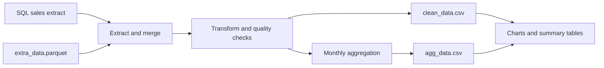
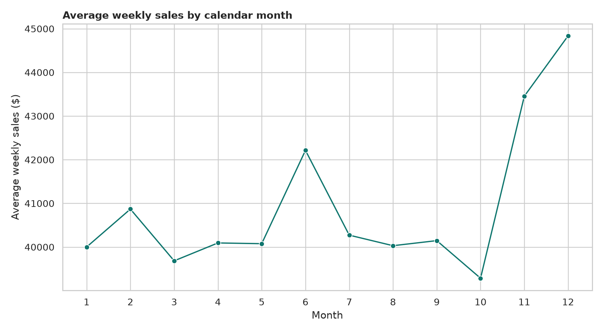
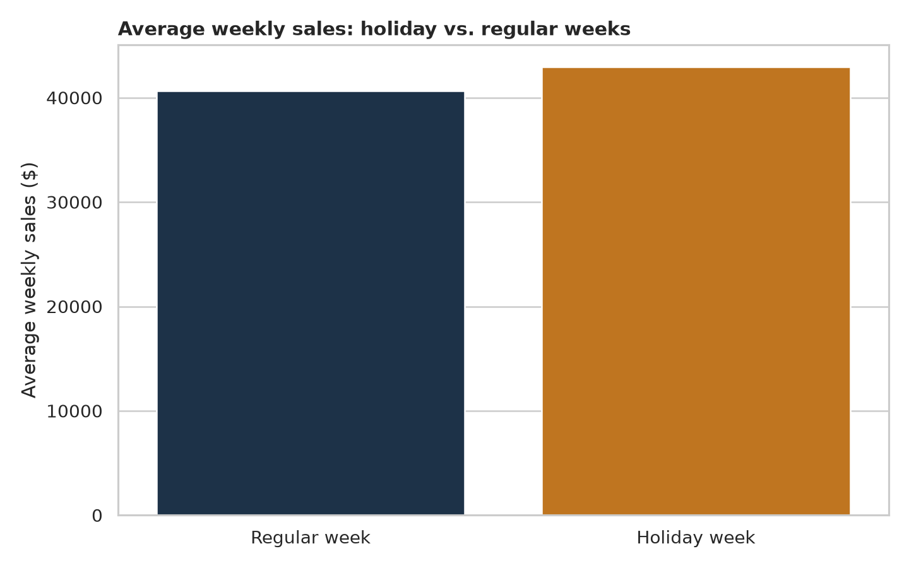

# Walmart E-commerce Sales Pipeline

This project turns a small DataCamp exercise into a reproducible retail ETL workflow. I built it around a practical question: **how do weekly sales vary by calendar month, and do qualifying holiday weeks look different from regular weeks?**

The project combines a sales extract with complementary store and economic data, cleans the result, creates a monthly aggregate, writes validated CSV outputs, and produces a few decision-oriented charts.

## What the pipeline does



The reusable functions are in [`src/pipeline.py`](src/pipeline.py):

- `extract()` merges the sales extract and Parquet data on `index`.
- `transform()` fills numeric gaps with column medians, parses dates, creates `Month`, applies the `Weekly_Sales > 10000` rule, and keeps the requested seven columns.
- `avg_weekly_sales_per_month()` calculates the rounded monthly average using the requested `groupby() → agg() → reset_index() → round()` chain.
- `load()` writes index-free CSV files.
- `validation()` confirms that the output files exist.

## Preliminary results from the included local extract

The uploaded notebook preserved a 20,000-row local display sample of the SQL result. Running the pipeline on that sample produced:

| Measure | Result |
| --- | ---: |
| Rows after the `Weekly_Sales > 10,000` filter | 10,946 |
| Stores represented after filtering | 2 |
| Departments represented after filtering | 62 |
| Highest average month | December |
| December average weekly sales | $44,837.10 |
| Holiday-week average lift | 5.5% |

These are descriptive results from the local sample, not a causal estimate or a full Walmart enterprise result. The holiday flag is not a controlled experiment, and the `> $10,000` threshold intentionally focuses the analysis on higher-sales rows.





## Repository structure

```text
.
├── data/
│   ├── raw/
│   │   ├── grocery_sales_sample.csv
│   │   ├── extra_data.parquet
│   │   └── README.md
│   └── processed/
│       ├── clean_data.csv
│       └── agg_data.csv
├── notebooks/
│   └── grocery_sales_pipeline.ipynb
├── reports/
│   ├── monthly_sales_trend.png
│   ├── holiday_sales_comparison.png
│   ├── top_store_sales.png
│   ├── analysis_summary.csv
│   ├── data_quality_report.csv
│   ├── holiday_summary.csv
│   └── top_stores.csv
├── scripts/
│   ├── analyze_outputs.py
│   ├── build_notebook.py
│   └── run_pipeline.py
├── sql/grocery_sales.sql
├── src/pipeline.py
├── tests/test_pipeline.py
└── .github/workflows/tests.yml
```

## Run it locally

```bash
python -m venv .venv

# macOS/Linux
source .venv/bin/activate

# Windows PowerShell
# .venv\Scripts\Activate.ps1

pip install -r requirements.txt
python scripts/run_pipeline.py
python scripts/analyze_outputs.py
pytest -q
```

The main outputs are written to `data/processed/`. The charts and summary tables are written to `reports/`.

To explore the workflow interactively:

```bash
jupyter notebook notebooks/grocery_sales_pipeline.ipynb
```

## Data and reproducibility note

In the DataCamp workspace, the SQL cell runs:

```sql
SELECT * FROM grocery_sales;
```

The full course result is automatically available as the pandas DataFrame `grocery_sales`. The repository preserves that query in [`sql/grocery_sales.sql`](sql/grocery_sales.sql). Because the uploaded notebook export only retained a 20,000-row display sample, the local file is deliberately named `grocery_sales_sample.csv`. The pipeline itself is written to accept the full SQL export without code changes.

The complementary file contains holiday, weather, fuel, markdown, CPI, unemployment, store type, and store size fields. The final cleaned table keeps only the columns required by the assignment:

`Store_ID`, `Month`, `Dept`, `IsHoliday`, `Weekly_Sales`, `CPI`, `Unemployment`

## Why I made these choices

- **Median imputation:** it is less sensitive to extreme sales values than a mean and keeps the pipeline deterministic.
- **One-to-one merge validation:** the complementary file should have one record per sales `index`; failing loudly is safer than silently multiplying rows.
- **Calendar month rather than year-month:** this follows the assignment and makes seasonal month comparisons easy. A forecasting version should retain year and date order.
- **Separate pipeline and notebook:** the notebook communicates the analysis; the tested Python module owns the business logic.
- **Explicit sample limitation:** the output is useful for demonstrating the pipeline, but the data boundary is documented rather than overstated.

## What I would investigate next

1. Replace the sample with the complete SQL extract and rerun the pipeline.
2. Compare holiday and non-holiday weeks within the same store and department.
3. Add promotion intensity from the markdown fields and control for store size.
4. Preserve `Year-Month` and build a time-based demand forecast.
5. Add a data-quality report for duplicate keys, invalid dates, missingness, and row-count reconciliation.

## Skills demonstrated

Python · pandas · Parquet · SQL · ETL design · data validation · automated tests · Jupyter · seaborn · matplotlib · GitHub Actions

## Attribution

This repository is based on the supplied DataCamp retail data-pipeline exercise. The implementation, tests, documentation, charts, and local reproducibility layer were added for portfolio use.
