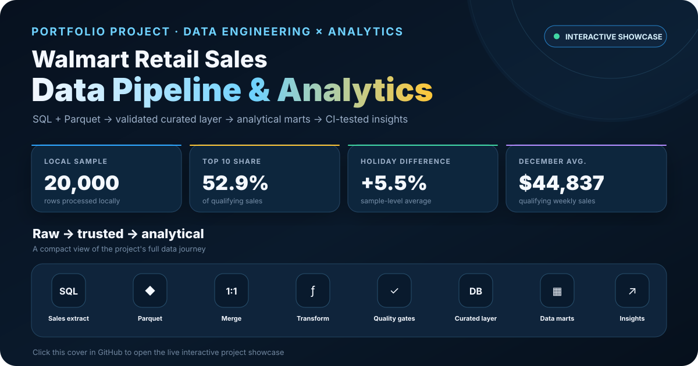
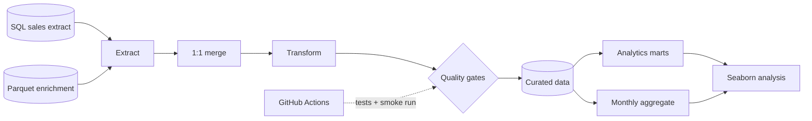

# Walmart Retail Sales Data Pipeline & Analytics

[](https://github.com/Danish-Mallick/walmart-ecommerce-sales-pipeline/actions/workflows/tests.yml)

[](https://danish-mallick.github.io/walmart-ecommerce-sales-pipeline/)

<p align="center">
  <a href="https://danish-mallick.github.io/walmart-ecommerce-sales-pipeline/"><strong>Launch Interactive Showcase →</strong></a>
</p>

I built this project around a simple requirement: take weekly retail sales data from two different sources, turn it into a reliable analytical dataset, and make sure the same process can be rerun without depending on a notebook.

The interesting part for me was not the final CSV. It was everything that had to be true before I trusted it: the join keys had to behave as expected, missing values had to be handled consistently, the output schema had to stay stable, and the pipeline had to fail when those assumptions were broken.

Once that layer was in place, I used the curated output to build a few small analytical marts and answer questions about seasonality, department contribution and holiday behaviour.

The repository uses a **20,000-row local sample**, so the results below describe that sample rather than a complete Walmart production dataset.

## Pipeline



The raw-to-curated logic lives in [`src/pipeline.py`](src/pipeline.py). The analytical transformations live separately in [`src/analytics.py`](src/analytics.py).

I kept that split deliberately. The charts should consume trusted data products; they should not contain a second, hidden version of the cleaning logic.

[Architecture notes](docs/architecture.md) · [Data contract](docs/data_contract.md)

---

## Building the trusted layer

### I validate the join before I trust the result

The sales extract and the enrichment dataset are joined on `index`.

I use a **one-to-one merge contract** instead of a normal unchecked merge. If either source contains duplicate keys, the pipeline stops. I would rather fail loudly than discover later that a many-to-many join quietly multiplied sales rows.

### The transformation is deterministic

The pipeline:

- checks that required source columns exist;
- fills numeric gaps with column medians;
- parses dates and removes invalid timestamps;
- derives calendar month;
- applies a configurable `Weekly_Sales` threshold;
- publishes a fixed seven-column curated schema.

The default threshold is **10,000** because that is the rule used for this analysis. It can be changed from the command line without changing the transformation code.

### I treat the output schema as a contract

Before anything is written, the curated dataframe must:

- match the expected columns;
- contain no missing values;
- contain valid calendar months;
- contain no rows below the configured threshold.

If one of those conditions fails, the pipeline fails with it.

### The pipeline publishes data products, not just one dataframe

| Output | Grain | Used for |
|---|---|---|
| [`clean_data.csv`](data/processed/clean_data.csv) | store / department / observation | trusted analytical source |
| [`agg_data.csv`](data/processed/agg_data.csv) | calendar month | monthly summary |
| [`month_department_sales.csv`](data/marts/month_department_sales.csv) | department × month | seasonality |
| [`department_holiday_sales.csv`](data/marts/department_holiday_sales.csv) | department | holiday comparison |
| [`department_sales_summary.csv`](data/marts/department_sales_summary.csv) | department | contribution and concentration |

The marts are built from the curated layer, not from the raw files.

---

# What I found after the pipeline was built

## When are qualifying weekly sales strongest?


Most months sit around a **$39k–$42k** average for qualifying weekly sales. The strongest values appear near the end of the year:

- **November:** $43,455
- **December:** $44,837
- **October:** $39,286

December is the highest monthly average in this sample.

Because the analysis is restricted to rows above the configured threshold, I treat this as a pattern in the curated dataset rather than a complete Walmart sales trend.

## Which departments contribute the most?


The department distribution is quite concentrated.

**Department 92** contributes about **$41.6M** in qualifying sales and **Department 95** about **$36.8M**.

The **top 10 departments account for 52.9%** of all qualifying sales in the sample.

That matters because an overall monthly trend can be driven by a relatively small part of the department mix.

## How concentrated is the department mix?


The concentration becomes clearer when I look at cumulative contribution:

- top 5 departments: **32.8%**
- top 10 departments: **52.9%**

That made the next question more useful than another company-level chart: do those departments behave the same way during holiday periods?

## Does the holiday pattern look the same across departments?

At sample level:

| Period | Average qualifying weekly sales |
|---|---:|
| Regular week | $40,678 |
| Holiday week | $42,929 |
| Difference | **+5.5%** |

I do not interpret that as a causal holiday effect. The data is observational, the sample is filtered, and department mix matters.

So I compared holiday and regular-week averages by department.


Among departments with enough observations for a more stable comparison:

- **Department 72:** +90.9%
- **Department 55:** +69.8%
- **Department 5:** +59.5%
- **Department 16:** -49.6%

The useful result is not that one department has a very large percentage. It is that the overall **+5.5%** average hides very different departmental patterns.

## Where do those seasonal differences appear?


The heatmap uses the twelve highest-sales departments and compares their average qualifying weekly sales by month.

The main takeaway is that **seasonality is not uniform**. Different high-value departments peak at different points, so the overall monthly line hides some of the mix underneath it.

---

## CI and reproducibility

GitHub Actions runs two jobs.

The first runs the unit and integration tests, including:

- duplicate-key rejection;
- one-to-one join behaviour;
- schema validation;
- numeric imputation;
- invalid-date handling;
- configurable filtering;
- output writing;
- end-to-end pipeline execution;
- analytical-mart calculations.

The second runs the pipeline itself:

1. rebuild the curated outputs;
2. build the analytical marts;
3. regenerate the Seaborn figures;
4. rebuild the summary files;
5. verify that expected outputs exist;
6. publish the generated files as a workflow artifact.

That gives me a quick check that the repository still works as one system after a code change.

---

## Repository structure

```text
.
├── .github/workflows/
│   └── tests.yml
├── data/
│   ├── raw/
│   ├── processed/
│   └── marts/
├── docs/
│   ├── architecture.md
│   └── data_contract.md
├── notebooks/
│   └── grocery_sales_pipeline.ipynb
├── reports/
├── scripts/
│   ├── run_pipeline.py
│   ├── build_analytics_marts.py
│   ├── plot_analytics.py
│   └── analyze_outputs.py
├── sql/
│   └── grocery_sales.sql
├── src/
│   ├── pipeline.py
│   └── analytics.py
└── tests/
    ├── test_pipeline.py
    └── test_analytics.py
```

## Run it locally

```bash
python -m venv .venv

# Windows PowerShell
.venv\Scripts\Activate.ps1

pip install -r requirements.txt

python scripts/run_pipeline.py
python scripts/build_analytics_marts.py
python scripts/plot_analytics.py
python scripts/analyze_outputs.py

pytest -q
```

To change the threshold:

```bash
python scripts/run_pipeline.py --min-weekly-sales 15000
```

## If I were taking this further

The next useful changes would be engineering changes rather than more charts:

1. load a complete source extract incrementally;
2. preserve source dates and `Year-Month` for partitioned processing;
3. write curated and mart layers as Parquet or Delta;
4. add row-count reconciliation, freshness and schema-drift monitoring;
5. persist pipeline-run metadata and quality results;
6. orchestrate the workflow with Azure Data Factory, Fabric Data Factory or Airflow;
7. make the loads idempotent and expose the output through a lakehouse or warehouse layer.
