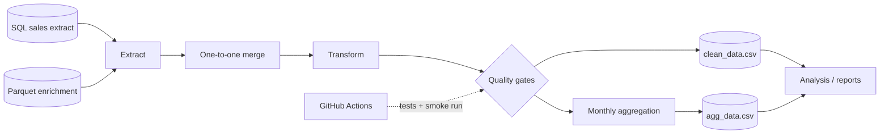
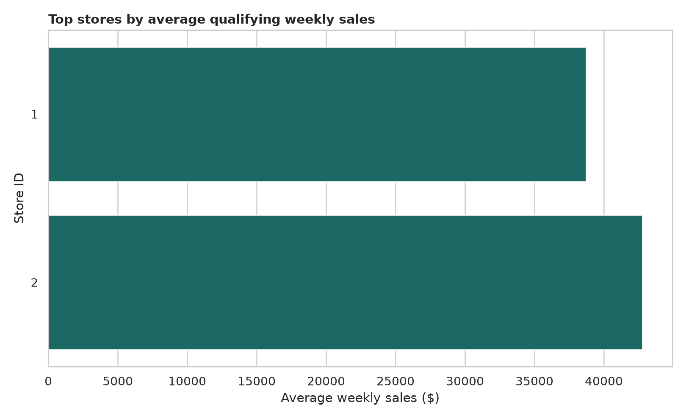

# Walmart Retail Sales ETL & Analytics Pipeline

[](https://github.com/Danish-Mallick/walmart-ecommerce-sales-pipeline/actions/workflows/tests.yml)

**Python · pandas · SQL · Parquet · Pytest · GitHub Actions**

I started this as a DataCamp transformation exercise, then rebuilt it as a small **data-engineering pipeline** that I could run, test and validate outside the course environment.

The business output is simple—cleaned weekly retail sales and a monthly aggregate—but the part I wanted to demonstrate is the engineering around it: **source contracts, one-to-one joins, deterministic transformations, data-quality gates, reusable modules, automated tests and CI smoke runs**.

The repository uses a **20,000-row local sample** preserved from the DataCamp SQL output. I do not present the sample as a complete Walmart enterprise dataset.

## Architecture



The notebook is a presentation layer. The actual pipeline logic lives in [`src/pipeline.py`](src/pipeline.py), so the same functions can be called from the command line, tests or a future orchestrator.

[Detailed architecture](docs/architecture.md) · [Data contract and quality rules](docs/data_contract.md)

## What I engineered

### 1. Extract with cardinality checks

The sales extract and Parquet enrichment data are joined on `index`.

I use a **one-to-one merge contract** instead of a normal unchecked merge. Duplicate keys on either side cause the run to fail. That prevents a common data-engineering failure mode: silently multiplying sales rows during enrichment.

### 2. Deterministic transformation

The transformation is implemented as reusable Python functions:

- validates required source columns;
- fills numeric gaps with column medians;
- parses dates and removes invalid timestamps;
- derives calendar month;
- applies a configurable `Weekly_Sales` threshold (default: **10,000**);
- projects an explicit seven-column curated schema.

The default threshold reproduces the original assignment, but the command-line option makes the pipeline reusable without changing code.

### 3. Explicit data-quality gates

Before data is published, the curated dataframe is checked for:

- exact schema;
- missing values;
- valid month values;
- compliance with the configured sales threshold.

The pipeline fails fast rather than allowing invalid rows into downstream outputs.

### 4. Curated and aggregate data products

The pipeline writes two index-free CSV outputs:

| Data product | Grain | Purpose |
|---|---|---|
| [`clean_data.csv`](data/processed/clean_data.csv) | qualifying store / department / week rows | curated input for analysis |
| [`agg_data.csv`](data/processed/agg_data.csv) | calendar month | average qualifying weekly sales |

Analysis scripts consume these outputs instead of duplicating the transformation logic.

### 5. Automated testing and CI

The test suite covers transformation logic **and pipeline behaviour**, including:

- one-to-one joins;
- duplicate-key rejection;
- schema enforcement;
- numeric imputation;
- invalid-date handling;
- configurable filtering;
- output writing;
- end-to-end pipeline execution.

GitHub Actions runs the tests and a second **pipeline smoke-test job**. The smoke test executes the ETL workflow, rebuilds the analytical outputs, verifies expected files and publishes the generated CSVs as a workflow artifact.

That CI layer is important because a pipeline that only works inside one notebook is not very convincing.

## Pipeline results on the included sample

After applying the default `Weekly_Sales > 10,000` rule:

| Measure | Result |
|---|---:|
| Rows in curated output | **10,946** |
| Stores represented | **2** |
| Departments represented | **62** |
| Highest monthly average | **December** |
| December average qualifying weekly sales | **$44,837.10** |
| Holiday-week average | **$42,929.42** |
| Regular-week average | **$40,678.45** |
| Observed holiday difference | **+5.5%** |

These figures are descriptive results from the local sample. The 5.5% difference is **not** a causal estimate of a holiday effect, and the `> 10,000` filter means it should not be interpreted as an all-Walmart sales statistic.




## Repository layout

```text
.
├── .github/workflows/
│   └── tests.yml                 # tests + end-to-end pipeline smoke run
├── data/
│   ├── raw/                      # source sample + Parquet enrichment
│   └── processed/                # curated and aggregate data products
├── docs/
│   ├── architecture.md           # pipeline design and layer responsibilities
│   └── data_contract.md          # schemas, quality rules and failure behaviour
├── notebooks/
│   └── grocery_sales_pipeline.ipynb
├── reports/                      # quality outputs, summary tables and charts
├── scripts/
│   ├── run_pipeline.py           # CLI entry point
│   └── analyze_outputs.py        # downstream analysis only
├── sql/
│   └── grocery_sales.sql         # original PostgreSQL source query
├── src/
│   └── pipeline.py               # reusable ETL + validation logic
└── tests/
    └── test_pipeline.py
```

## Run the pipeline

```bash
python -m venv .venv

# Windows PowerShell
.venv\Scripts\Activate.ps1

pip install -r requirements.txt
python scripts/run_pipeline.py
python scripts/analyze_outputs.py
pytest -q
```

To change the sales threshold without editing the source:

```bash
python scripts/run_pipeline.py --min-weekly-sales 15000
```

## Data lineage and reproducibility

In the DataCamp workspace, the source query is:

```sql
SELECT *
FROM grocery_sales;
```

The query is preserved in [`sql/grocery_sales.sql`](sql/grocery_sales.sql). DataCamp exposes the complete result as a dataframe, but the exported notebook retained only a **20,000-row display sample**. That sample is stored as `grocery_sales_sample.csv` so the repository remains runnable without database credentials.

The complementary Parquet file contains holiday, weather, fuel, markdown, CPI, unemployment and store attributes. The current curated contract intentionally publishes only:

`Store_ID`, `Month`, `Dept`, `IsHoliday`, `Weekly_Sales`, `CPI`, `Unemployment`.

Replacing the sample with the full SQL export does not require changing the pipeline code.

## Engineering decisions

**Why median imputation?**  
The assignment requires numeric gaps to be filled. Median imputation is deterministic and less sensitive to extreme values than the mean. In a production system I would make the policy column-specific and monitor the imputation rate.

**Why fail on duplicate join keys?**  
A many-to-many merge can inflate row counts and sales without an obvious runtime error. The explicit cardinality check converts that silent data-quality problem into a visible pipeline failure.

**Why keep logic outside the notebook?**  
The notebook communicates the workflow. `src/pipeline.py` owns the transformation logic, which prevents the notebook, CLI and tests from drifting into different implementations.

**Why CSV outputs?**  
CSV keeps this portfolio project easy to inspect. For larger volumes I would publish partitioned Parquet/Delta tables and register them in a governed catalog rather than use CSV as the serving format.

## What I would build next

The next engineering step is not to add more charts. I would move this design toward a scheduled incremental pipeline:

1. ingest a complete source extract rather than the notebook sample;
2. preserve `Year-Month` and source dates for partitioned time-series processing;
3. write curated data as Parquet or Delta rather than CSV;
4. add row-count reconciliation and freshness metrics;
5. persist pipeline-run metadata and quality results;
6. orchestrate the workflow in Azure Data Factory, Fabric Data Factory or Airflow;
7. add idempotent incremental loading and a warehouse/lakehouse serving layer.

Those changes would be appropriate for a real data platform; I kept this repository deliberately small enough for a reviewer to understand the complete pipeline.

## Skills demonstrated

**Data engineering:** ETL design · schema contracts · data validation · data lineage · join cardinality · data-quality checks · reproducible pipelines  
**Technology:** Python · pandas · PostgreSQL · Parquet · Pytest · GitHub Actions · Jupyter · Seaborn · Matplotlib

## Attribution

The starting exercise and supplied retail data come from DataCamp. The modular pipeline, validations, tests, CI workflow, documentation, local reproducibility layer and analytical outputs were developed for this portfolio repository.
