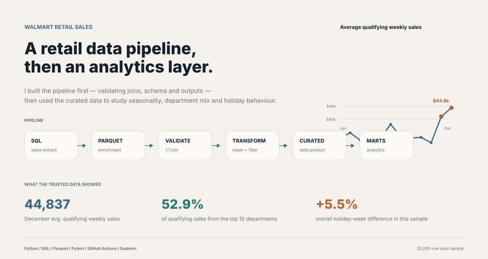
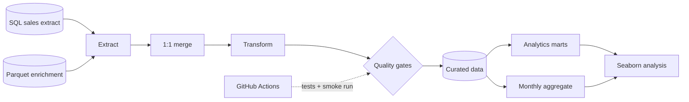
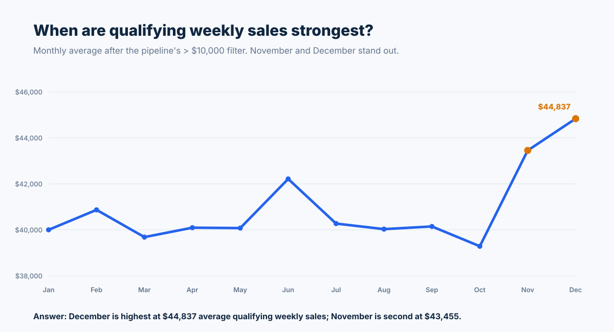
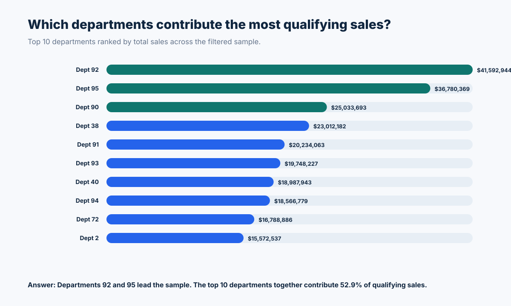
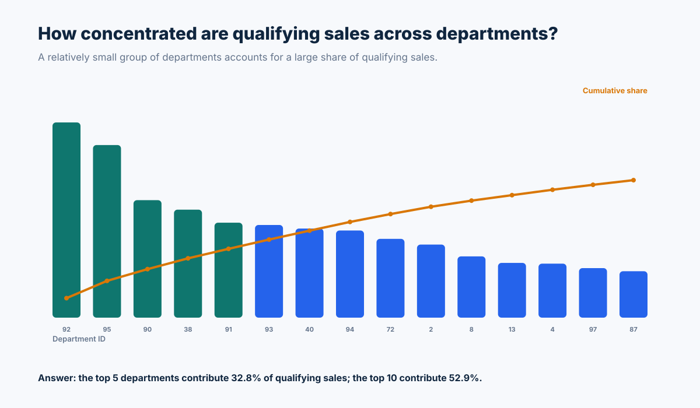
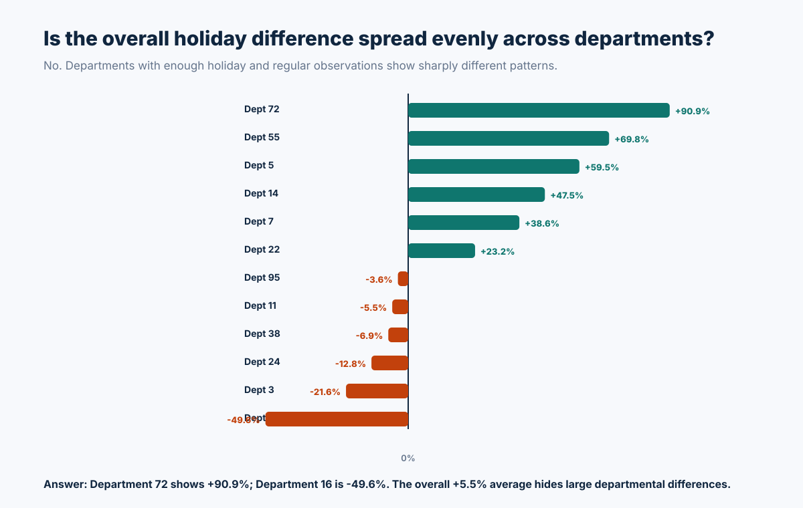
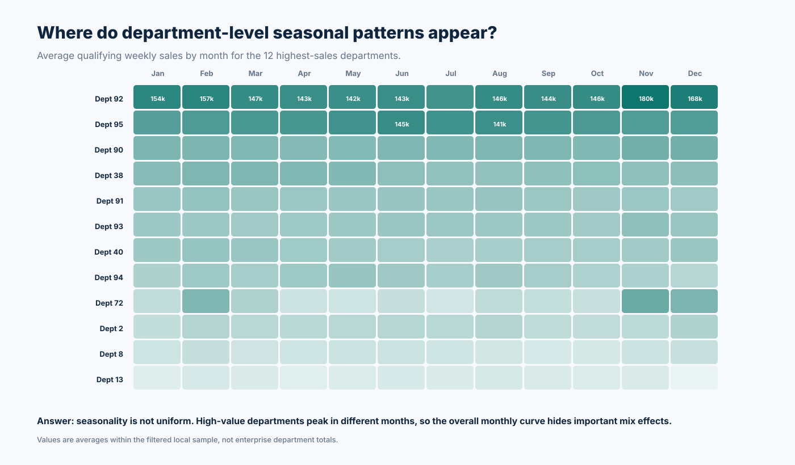

# Walmart Retail Sales Data Pipeline & Analytics

[](https://github.com/Danish-Mallick/walmart-ecommerce-sales-pipeline/actions/workflows/tests.yml)



**Python · pandas · SQL · Parquet · Pytest · GitHub Actions · Seaborn**

I started this as a DataCamp transformation exercise, then rebuilt it as a small **data-engineering project with a downstream analytics layer**.

The first goal was not to make charts. It was to create a pipeline I could trust: validate the input structure, prevent bad joins, apply deterministic transformations, enforce a curated schema, write repeatable outputs, and rerun everything in CI. Once that layer was stable, I used the curated data to build analytical marts and answer a second set of questions about seasonality, department contribution and holiday behaviour.

The repository uses a **20,000-row local sample** preserved from the DataCamp SQL output. The results below describe that sample after the assignment's default `Weekly_Sales > 10,000` filter; they are not presented as full Walmart enterprise results.

## Architecture



The notebook is a presentation layer. The ETL logic lives in [`src/pipeline.py`](src/pipeline.py), while downstream analytical transformations live in [`src/analytics.py`](src/analytics.py). This separation keeps the raw-to-curated pipeline independent from the questions asked later.

[Detailed architecture](docs/architecture.md) · [Data contract and quality rules](docs/data_contract.md)

---

## 1. Building the trusted data layer

### Extract and join validation

The sales extract and the Parquet enrichment file are joined on `index`. Both inputs must have unique keys.

I use a **one-to-one merge contract** rather than an unchecked merge. If either side contains duplicate join keys, the pipeline fails instead of silently multiplying rows and overstating sales.

### Transformation

The pipeline then:

- checks required source columns;
- fills numeric gaps with deterministic median values;
- parses dates and removes invalid timestamps;
- derives calendar month;
- applies a configurable weekly-sales threshold;
- publishes an explicit seven-column curated schema.

The default threshold is **10,000**, matching the original assignment, but it can be changed from the command line without editing source code.

### Quality gates

Before data is published, the curated dataframe must:

- match the expected schema exactly;
- contain no missing values;
- contain valid calendar months;
- contain no rows below the configured threshold.

These checks turn data-quality problems into visible pipeline failures.

### Data products

| Product | Grain | Purpose |
|---|---|---|
| [`clean_data.csv`](data/processed/clean_data.csv) | store / department / observation | trusted curated input |
| [`agg_data.csv`](data/processed/agg_data.csv) | calendar month | monthly assignment output |
| [`month_department_sales.csv`](data/marts/month_department_sales.csv) | department × month | seasonal analytics mart |
| [`department_holiday_sales.csv`](data/marts/department_holiday_sales.csv) | department | holiday comparison mart |
| [`department_sales_summary.csv`](data/marts/department_sales_summary.csv) | department | contribution / concentration mart |

The marts are built **from the curated output**, not from the raw files. That is intentional: downstream analysis should consume a trusted data product rather than recreate cleaning logic independently.

---

# What I did after the pipeline was built

Once the engineering layer was stable, I treated the curated dataset like a small analytical source and asked a series of business questions.

## 2. When are qualifying weekly sales strongest?



Most months in the sample sit around a **$39k–$42k** average for qualifying weekly sales. The strongest values appear near the end of the year:

- **November:** $43,455 average qualifying weekly sales
- **December:** $44,837, the highest monthly average in the sample
- **October:** $39,286

The result is descriptive and uses only rows that survive the `> 10,000` filter. I therefore interpret it as a pattern within the curated sample, not as a complete monthly Walmart sales trend.

## 3. Which departments contribute the most qualifying sales?



Department-level analysis shows that the sales distribution is not even.

**Departments 92 and 95 are the two largest contributors in this sample.** Department 92 records approximately **$41.6M** in qualifying sales and Department 95 approximately **$36.8M**.

Looking beyond the top two, the **top 10 departments account for 52.9%** of qualifying sales. That concentration is useful because it shows that aggregate monthly movement can be influenced heavily by a relatively small set of departments.

## 4. How concentrated is the department mix?



The concentration view adds another perspective:

- the **top 5 departments contribute 32.8%** of qualifying sales;
- the **top 10 contribute 52.9%**.

That made me cautious about treating the monthly trend as if every department moved in the same way. A stronger next question was whether different departments behaved differently around holiday periods.

## 5. Is the overall holiday difference spread evenly across departments?

The sample-level comparison shows:

| Period | Average qualifying weekly sales |
|---|---:|
| Regular week | $40,678 |
| Holiday week | $42,929 |
| Difference | **+5.5%** |

That does **not** mean holidays caused a 5.5% increase. The dataset is filtered, the holiday flag is observational, and departments differ in their mix.

So I looked one level deeper.



Among departments with at least five holiday observations and twenty regular observations, the pattern varies substantially.

**Department 72 shows the largest positive difference at +90.9%, while Department 16 is 49.6% lower during holiday weeks.**

The important finding is not the extreme percentages by themselves. It is that the overall +5.5% average hides very different departmental behaviour.

## 6. Where do department-level seasonal patterns appear?



I then built a department × month mart and visualized the twelve highest-sales departments as a heatmap.

The result confirms that **seasonality is not uniform across departments**. Some high-value departments strengthen late in the year, while others peak at different points.

That means a single monthly company-level trend is useful for orientation, but it is not sufficient for explaining *which parts of the business* are producing the change.

---

## CI and reproducibility

GitHub Actions runs two independent jobs:

### Unit and integration tests

The test suite checks:

- one-to-one joins;
- duplicate-key rejection;
- schema enforcement;
- numeric imputation;
- invalid-date handling;
- configurable sales thresholds;
- output writing;
- end-to-end pipeline execution;
- analytics-mart grain and calculations.

### Pipeline smoke test

The second job:

1. executes the ETL pipeline;
2. rebuilds the analytical marts;
3. regenerates the Seaborn figures;
4. rebuilds the original summary outputs;
5. verifies expected files;
6. publishes the generated CSV and SVG outputs as a workflow artifact.

This is important because the repository is designed to demonstrate more than a notebook that happened to run once.

---

## Repository structure

```text
.
├── .github/workflows/
│   └── tests.yml
├── data/
│   ├── raw/                         # sample SQL extract + Parquet enrichment
│   ├── processed/                   # trusted curated outputs
│   └── marts/                       # analytical data products
├── docs/
│   ├── architecture.md
│   └── data_contract.md
├── notebooks/
│   └── grocery_sales_pipeline.ipynb
├── reports/
│   ├── engineering_analytics_overview.svg
│   ├── monthly_sales_story.svg
│   ├── top_departments.svg
│   ├── department_sales_concentration.svg
│   ├── holiday_uplift_by_department.svg
│   └── department_month_heatmap.svg
├── scripts/
│   ├── run_pipeline.py
│   ├── build_analytics_marts.py
│   ├── plot_analytics.py
│   └── analyze_outputs.py
├── sql/
│   └── grocery_sales.sql
├── src/
│   ├── pipeline.py
│   └── analytics.py
└── tests/
    ├── test_pipeline.py
    └── test_analytics.py
```

## Run everything locally

```bash
python -m venv .venv

# Windows PowerShell
.venv\Scripts\Activate.ps1

pip install -r requirements.txt

python scripts/run_pipeline.py
python scripts/build_analytics_marts.py
python scripts/plot_analytics.py
python scripts/analyze_outputs.py

pytest -q
```

To rerun the pipeline with another threshold:

```bash
python scripts/run_pipeline.py --min-weekly-sales 15000
```

## Data lineage

In the DataCamp workspace, the source query is:

```sql
SELECT *
FROM grocery_sales;
```

The complete DataCamp result is not stored here. The exported notebook retained a **20,000-row display sample**, saved as `grocery_sales_sample.csv` so the project remains reproducible without database credentials.

The Parquet enrichment source contains holiday, economic and store attributes. The current curated contract publishes:

`Store_ID`, `Month`, `Dept`, `IsHoliday`, `Weekly_Sales`, `CPI` and `Unemployment`.

Replacing the local sample with the complete SQL export does not require rewriting the ETL logic.

## Engineering decisions

**Why validate join cardinality?**  
Many-to-many joins can inflate row counts and financial measures while still producing a technically valid dataframe. I prefer to fail immediately when a source violates the expected key contract.

**Why separate the pipeline and analytics modules?**  
The ETL layer should define trusted data. The analytical layer should consume it. Keeping them separate prevents a charting notebook from becoming an undocumented second transformation pipeline.

**Why create marts instead of charting directly from `clean_data.csv`?**  
The marts make the analytical grain explicit and reusable. A department-month heatmap and a holiday comparison have different grains, so each gets a small purpose-built table.

**Why CSV for this portfolio?**  
It keeps the repository easy to inspect. For a larger platform I would publish partitioned Parquet or Delta tables and expose them through a governed lakehouse / warehouse serving layer.

## What I would productionize next

The next step would be to move from a batch portfolio workflow toward a real platform:

1. ingest a complete source extract incrementally;
2. preserve source dates and `Year-Month` for partitioned processing;
3. write curated and mart layers as Parquet or Delta;
4. add row-count reconciliation, freshness and schema-drift monitoring;
5. persist pipeline-run metadata and quality results;
6. orchestrate with Azure Data Factory, Fabric Data Factory or Airflow;
7. add idempotent incremental loads and a lakehouse / warehouse serving layer.

## Skills demonstrated

**Data engineering:** ETL design · source contracts · schema validation · join cardinality · data quality · analytical marts · data lineage · CI/CD · reproducibility

**Analytics:** dimensional aggregation · department contribution · holiday comparison · seasonality analysis · Seaborn visualization

**Technology:** Python · pandas · PostgreSQL · Parquet · Pytest · GitHub Actions · Jupyter · Seaborn · Matplotlib

## Attribution

The starting exercise and supplied retail data come from DataCamp. The modular pipeline, quality checks, analytical marts, tests, CI workflow, documentation and analytical layer were developed for this portfolio repository.
