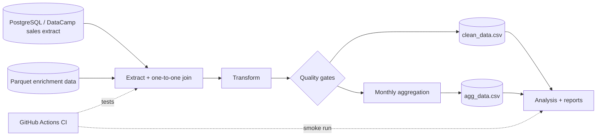

# Pipeline architecture

This repository is intentionally small, but the workflow is structured like a production data pipeline: source contracts are checked early, transformation logic is kept outside the notebook, curated outputs are validated before publication, and CI reruns both tests and the pipeline.

## Layer responsibilities

### Source layer

- **Sales extract:** the SQL result exported from the DataCamp workspace.
- **Enrichment layer:** Parquet data containing holiday, economic and store attributes.
- The join key is `index`. Both sides are required to be unique before the merge.

### Transformation layer

`src/pipeline.py` owns the business logic. The notebook does not contain a separate version of the pipeline.

The transformation:

1. validates required source columns;
2. performs a one-to-one merge;
3. fills numeric gaps with deterministic median values;
4. parses dates and removes invalid timestamps;
5. derives calendar month;
6. applies the configurable weekly-sales threshold;
7. projects the curated seven-column schema.

### Quality gates

The curated dataframe must:

- contain the exact expected columns;
- contain no missing values;
- contain months between 1 and 12;
- contain only rows above the configured sales threshold.

The pipeline fails fast when these rules are violated.

### Serving layer

Two CSV products are written:

- `clean_data.csv`: row-level curated records for downstream analysis.
- `agg_data.csv`: monthly average qualifying weekly sales.

Analytical scripts read these outputs rather than rebuilding the transformation independently.

### CI layer

GitHub Actions runs:

- Python compilation;
- unit and integration tests;
- a full pipeline smoke test using the repository sample;
- report generation;
- artifact publication for the generated CSV outputs.

This keeps the repository demonstrably reproducible without claiming that the sample is a production Walmart feed.
