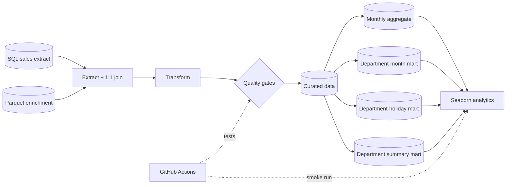

# Pipeline architecture

The repository separates ingestion and transformation from downstream analytics.

## Source layer

The local source layer contains a sample of the DataCamp SQL result and the complementary Parquet dataset.

The `index` key is expected to be unique on both sides of the merge. Violations cause the pipeline to fail.

## Curated layer

`src/pipeline.py` owns the raw-to-curated business logic. It validates source columns, performs the one-to-one merge, imputes numeric gaps, parses dates, derives month, applies the configurable sales threshold and enforces the final schema.

The main curated output is `data/processed/clean_data.csv`.

## Mart layer

`src/analytics.py` builds three downstream data products from the curated dataset:

- `month_department_sales.csv` — department × month grain;
- `department_holiday_sales.csv` — department grain with regular / holiday comparison;
- `department_sales_summary.csv` — department contribution and cumulative share.

The analysis does not bypass the curated layer to read raw data directly.

## Presentation layer

`scripts/plot_analytics.py` uses Seaborn / Matplotlib to create the analytical figures from those marts.

This makes the dependency chain visible:

**source → curated data → marts → analysis**

## CI layer

GitHub Actions runs both the test suite and a full pipeline smoke test. The smoke job rebuilds the curated data, marts, analytical figures and summary files, checks that expected outputs exist, and publishes the generated files as an artifact.
